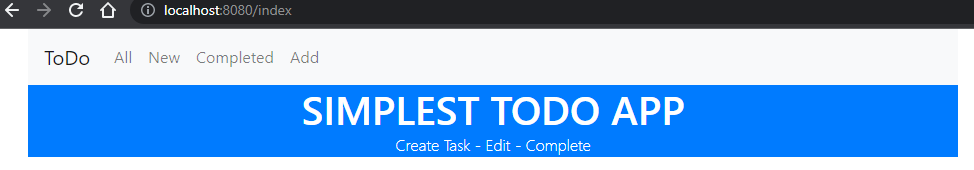
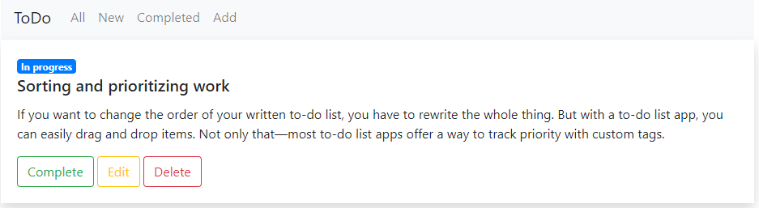
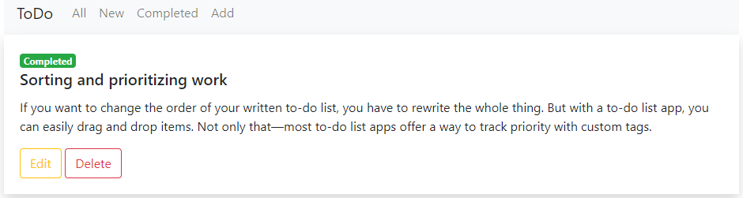
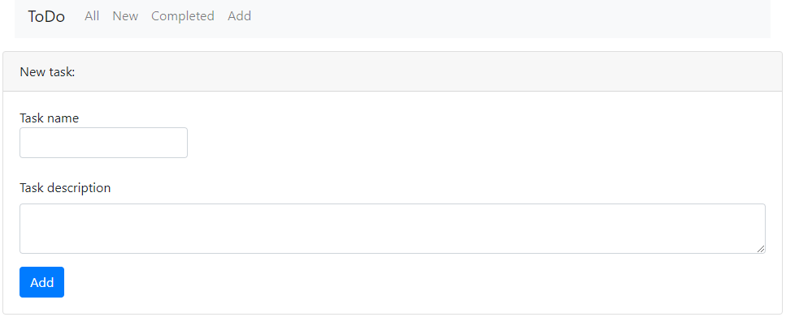
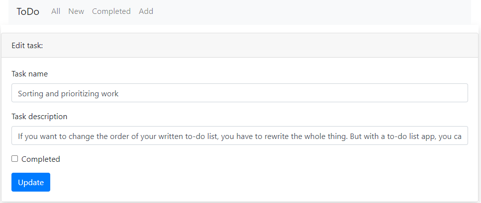

# job4j_todo

## TODO list

Simplest ToDo app.
All - all the tasks
New - list of the tasks are in progress
Completed - list of completed tasks
Add - to add a new task

Technologies used: Java, Spring Boot, Thymeleaf, HTML, CSS, Bootstrap, Hibernate

