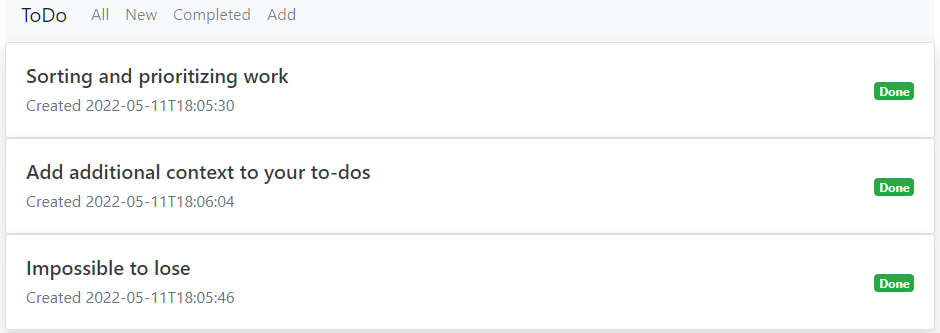

# job4j_todo

## TODO list

Simplest ToDo app. 
All - all the tasks 
New - list of the tasks are in progress 
Completed - list of completed tasks 
Add - to add a new task 

Technologies used: Java, Spring Boot, Thymeleaf, HTML, CSS, Bootstrap, Hibernate 

